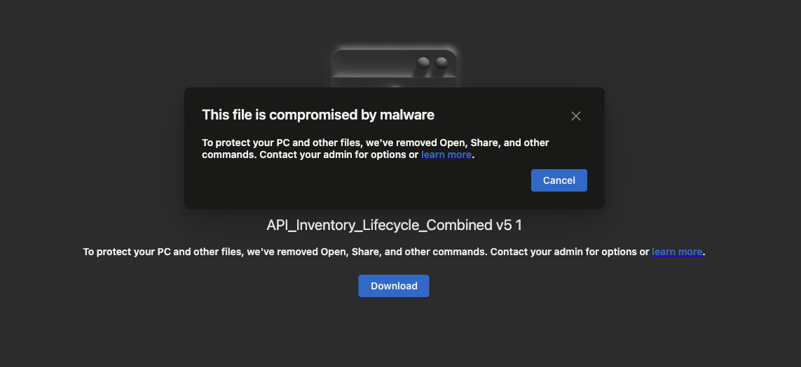

# claude-toolkit

Tools that make Claude smarter for ServiceNow work - contributed by a ServiceNow ITOM practitioner, shared to peers.

Everything here works inside **Claude Code** (the command-line app). Some tools also have a **Claude Desktop** version — noted where applicable.

| Tool | What it does |
|------|-------------|
| [Claude Desktop and ServiceNow docsite](https://jwservicenow.github.io/claude-toolkit/docs/servicenow-mirror-desktop-guide.html) | Claude Desktop can't read the ServiceNow docsite directly — this fixes it. Wires in a custom MCP fetch server to pull from the GitHub docs mirror, then locks it down with Project Instructions that re-enforces docsite-only answers with citable URLs. |
| [/servicenow_rag](#servicenow_rag) | Claude Code skill — Fetches from ServiceNow's official GitHub docs mirror first, then KB, Community, and developer sites in order. Grounded answers with citable URLs; AI assumptions flagged explicitly. |
| [/newsession](#newsession) | Long chat getting slow or pricey? Turn it into a compact handoff you paste into a fresh session — after a quick check for loose ends worth finishing first |
| [/newplan](#newplan) | Turn a goal into an approved, written plan — interviews you, asks clarifying questions, provides 3–4 ranked approaches with trade-offs, saved as a plan file |
| [PDI integration - native MCP install](docs/pdi_native_mcp_install_guide.md) | Connect Claude Code to ServiceNow using the platform's ootb MCP — no scripts needed, OAuth 2.1 security profile with PKCE, 17 purpose-built tools |
| [Status bar](#status-bar-customization) | Show model, context size, usage bar, and session cost at the bottom of Claude Code session UI |
| [Using Multiple Claude Subscriptions on Mac](docs/dual-subscription-setup.md) | Run ServiceNow's Enterprise account and your personal Claude account on the same Mac without them mixing — separate configs, separate sessions |

---

### `Claude Desktop and ServiceNow docsite`

**[View the setup guide](https://jwservicenow.github.io/claude-toolkit/docs/servicenow-mirror-desktop-guide.html)** or download using curl:

```bash
curl -o ~/Downloads/servicenow-mirror-desktop-guide.html \
  https://raw.githubusercontent.com/jwservicenow/claude-toolkit/main/docs/servicenow-mirror-desktop-guide.html
open ~/Downloads/servicenow-mirror-desktop-guide.html
```

Follow the steps inside — about 10 minutes total.

---

### `/servicenow_rag`

Claude Code version — Fetches directly from ServiceNow's official GitHub docs mirror before answering. The same plain-text source ServiceNow publishes for AI tools. Supplements with Support site KBs, Community posts, and developer.servicenow.com in priority order. Every answer is grounded in a retrieved source; anything drawn from AI training knowledge is explicitly flagged as an assumption.


<details>
<summary>How it works under the hood</summary>

ServiceNow publishes a copy of their documentation as plain text files on GitHub at `ServiceNow/ServiceNowDocs`, specifically so AI tools can read it. This command goes straight to that source:

1. Looks up the right documentation bundle from ServiceNow's published index.
2. Finds the specific topic file in that bundle and reads it — citing the real docs.servicenow.com URL.
3. Supplements with Now Support KB (~90% trusted) — known issues, gotchas, platform-specific behavior.
4. Supplements with ServiceNow Community (~80% trusted) — real-world workarounds and operational context.
5. Supplements with developer.servicenow.com (~90% trusted) — APIs, scripting references, how-to guides.
6. Supplements with the official @servicenow YouTube channel (reference only) — surfaces video links, content not fetchable.
7. Falls back to the same sources if the mirror has nothing — flagged clearly so you know what's grounded vs. assumed.
8. Stops and tells you if retrieval fails entirely. Any training-knowledge gap is explicitly flagged as an assumption.

</details>

**Install**

```bash
mkdir -p ~/.claude/commands
curl -o ~/.claude/commands/servicenow_rag.md \
  https://raw.githubusercontent.com/jwservicenow/claude-toolkit/main/commands/servicenow_rag.md
```

Restart Claude Code. Then type `/servicenow_rag` followed by your question.

**Check it's working** — ask something too specific for Claude to know from memory:
```
/servicenow_rag what sys_property controls Discovery IP range exclusions?
```
If Claude fetches from GitHub before answering, it's working. If it answers immediately with no fetch step, something went wrong during install.

---

### `/newsession`

Long conversations get slow, lose the thread, and burn tokens. Type `/newsession` and it does two things: first it scans the session for loose ends and asks whether any are better finished *now* than handed off; then it writes a dense, structured handoff — goal, decisions, constraints, next action — and saves it as a resume file right in your project folder. Paste it into a new chat and pick up exactly where you left off, no replaying history.

Optionally pass a filename and the next session will be shaped around that file:
```
/newsession my-runbook.md
```

**Install**

```bash
mkdir -p ~/.claude/skills/newsession
curl -o ~/.claude/skills/newsession/SKILL.md \
  https://raw.githubusercontent.com/jwservicenow/claude-toolkit/main/skills/newsession/SKILL.md
```

Restart Claude Code. Then type `/newsession`.

---

### `/newplan`

Type `/newplan` followed by what you want to do. Claude explores your project for context, asks up to four clarifying questions, then lays out three to four approaches ranked by trade-offs. It self-reviews, presents the plan for your approval, and on your OK writes a complete, self-contained plan file into your project folder — ready to hand to a fresh session or a teammate.

```
/newplan migrate our CMDB to CSDM
/newplan set up Discovery for Azure
```

**Install**

```bash
mkdir -p ~/.claude/skills/newplan
curl -o ~/.claude/skills/newplan/SKILL.md \
  https://raw.githubusercontent.com/jwservicenow/claude-toolkit/main/skills/newplan/SKILL.md
```

Restart Claude Code. Then type `/newplan`.

---

### `Connect Claude Code to PDI: Native MCP install guide`

Connects Claude Code to your ServiceNow instance using the platform's own built-in connector. No local Python script, no clear text passwords — credentials stay in your macOS Keychain. Gives you 17 purpose-built tools for CMDB, ITSM, and ITOM work.

**Requires:** ServiceNow Australia release (Zurich Patch 9+) with Now Assist. If your instance doesn't meet that, use the DIY Table-API guide instead.

[Open the guide](docs/pdi_native_mcp_install_guide.md)

---

### `Status bar customization`



Shows your working folder, which model you're on, context window size, live usage bar and session cost. Useful for knowing when a conversation is getting too long or too expensive.

**Install**

**Requires `jq`.** Check if you have it: run `jq --version` in your terminal. If not:
```bash
brew install jq
```

**Step 1** — Download the script:
```bash
curl -o ~/.claude/statusline-command.sh \
  https://raw.githubusercontent.com/jwservicenow/claude-toolkit/main/scripts/statusline-command.sh
chmod +x ~/.claude/statusline-command.sh
```

**Step 2** — Open `~/.claude/settings.json` in a text editor and add this block inside the outermost `{ }`:
```json
"statusLine": {
  "type": "command",
  "command": "sh ~/.claude/statusline-command.sh"
}
```

**Step 3** — Restart Claude Code.

> **Running two Claude accounts?** If you followed the dual-account setup guide, add the `statusLine` block to `~/.claude-work/settings.json` and/or `~/.claude-personal/settings.json` instead of `~/.claude/settings.json`.

---

### `Using Multiple Claude Subscriptions on Mac`

- **[dual-subscription-setup.md](docs/dual-subscription-setup.md)** — How to run a personal and a work Claude account on the same Mac without them mixing. About 15 minutes start to finish.

---

<sub>Re-run any `curl` command above to get the latest version. Bugs or requests → [open an issue](https://github.com/jwservicenow/claude-toolkit/issues). [MIT License](LICENSE).</sub>
