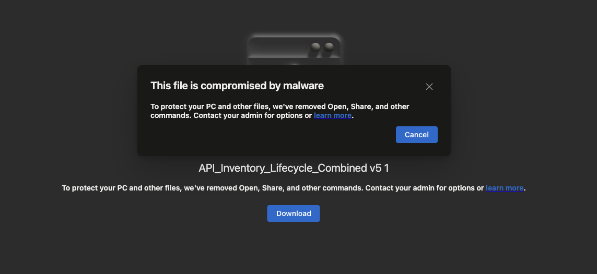

# claude-toolkit

Tools that make Claude smarter for ServiceNow work - contributed by a ServiceNow ITOM practitioner, shared to peers.

Everything here works inside **Claude Code** (the command-line app). Some tools also have a **Claude Desktop** version — noted where applicable.

`/newsession` and `/newplan` come in two tiers you can install side by side and switch between freely — they're separate commands, so installing or trying one never touches the other: **lite** (below, the default, battle-tested) and **advanced** (`-pro` suffix, opt-in, not yet battle-tested).

| Tool | What it does |
|------|-------------|
| [Claude Desktop RAG](https://jwservicenow.github.io/claude-toolkit/docs/servicenow-mirror-desktop-guide.html) **· v3** | Claude Desktop can't read the ServiceNow docsite directly — this fixes it. Wires in a custom MCP fetch server to pull from the [GitHub docs mirror](https://github.com/ServiceNow/ServiceNowDocs#servicenowdocs), then locks it down with Project Instructions that re-enforces docsite-only answers with citable URLs. |
| [/servicenow_rag](#servicenow_rag) | Claude Code RAG skill — Navigates ServiceNow's official [GitHub docs mirror](https://github.com/ServiceNow/ServiceNowDocs#servicenowdocs) from its published index down to the exact topic file, then supplements with a scoped ServiceNow Community search. Answers are cited to real docs.servicenow.com URLs; it won't invent a doc path, and says so when the docs don't cover something. |
| [/newsession](#newsession) **· lite, default** | Long chat getting slow or pricey? Turn it into a compact handoff you paste into a fresh session — goal, decisions, constraints, next action, written straight to your project folder |
| [/newplan](#newplan) **· lite, default** | Turn a goal into an approved, written plan — interviews you, asks clarifying questions, provides 3–4 ranked approaches with trade-offs, saved as a plan file that closes itself into `archive/` when done |
| [/newsession-pro](#newsession-pro) **· advanced, not yet battle-tested** | Matured `/newsession` — adds a sweep for anything the session measured or decided but never wrote down, filing it into findings/defects/runbook artifacts before the handoff |
| [/newplan-pro](#newplan-pro) **· advanced, not yet battle-tested** | Matured `/newplan` — opens by searching findings/defects/runbook you already recorded (`recall.sh`), so long projects stop re-deriving their own conclusions, and governs when each record artifact gets written |
| [/security-audit](#security-audit) | Scans the whole codebase for OWASP Top 10 patterns, dependency CVEs, hardcoded secrets, weak auth, and risky config — an audit of everything, not just your pending diff |
| [/ai-security](#ai-security) | Security review for AI/LLM systems and agents — prompt injection (direct and indirect), agent tool abuse, guardrail resistance, model inversion and data-poisoning exposure, mapped to MITRE ATLAS |
| [/deps-audit](#deps-audit) | Dependency health check — known vulnerabilities, outdated and unused packages, license compliance. Detects your package manager (npm/yarn/pnpm, pip/poetry, …) and ranks what to fix first |
| [/prompt-sweep](#prompt-sweep) | Housekeeping backstop — finds retired `/newsession` handoff files and, with your consent, files the superseded ones into each project's own `archive/`. Never touches an active prompt, never deletes |
| [/token-audit](#token-audit) | Checks your Claude Code accounts for token waste — oversized `CLAUDE.md` files, MCP server bloat, undocumented `settings.json` keys, dead hooks, and actual cache/token usage totals per account |
| [RAG demo walkthrough](https://jwservicenow.github.io/claude-toolkit/docs/servicenow-rag-demo-walkthrough-2026-08-08.html) | Annotated end-to-end run of `/servicenow_rag` against a real question — what it fetches, in what order, and why |
| [Mirror retrieval testing](docs/mirror-testing/) | Test artifacts and mirror-side recommendations from evaluating the ServiceNow docs mirror as an AI retrieval source, plus the [model × thinking-effort benchmark](https://jwservicenow.github.io/claude-toolkit/docs/mirror-testing/model-thinking-sweep-writeup-2026-08-09.html) behind the model guidance |
| [PDI integration - native MCP install](docs/pdi_native_mcp_install_guide.md) | Connect Claude Code to ServiceNow using the platform's ootb MCP — no scripts needed, OAuth 2.1 security profile with PKCE, 17 purpose-built tools |
| [Status bar](#status-bar-customization) | Show model, context size, usage bar, and session cost at the bottom of Claude Code session UI |
| [Using Multiple Claude Subscriptions on Mac](docs/dual-subscription-setup.md) | Run ServiceNow's Enterprise account and your personal Claude account on the same Mac without them mixing — separate configs, separate sessions |
| [SSH Agent Key Management for Claude Homelab Access](docs/ssh-agent-homelab.md) | Load a passphrase-protected SSH key into the macOS agent for a configurable window (default 2h) so Claude can reach your lab hosts — and access expires automatically when you're done |

---

### `Claude Desktop and ServiceNow docsite`

**[View the setup guide](https://jwservicenow.github.io/claude-toolkit/docs/servicenow-mirror-desktop-guide.html)** (v3, 9 Aug 2026) or download using curl:

```bash
curl -o ~/Downloads/servicenow-mirror-desktop-guide.html \
  https://raw.githubusercontent.com/jwservicenow/claude-toolkit/main/docs/servicenow-mirror-desktop-guide.html
open ~/Downloads/servicenow-mirror-desktop-guide.html
```

Follow the steps inside — about 10 minutes total.

---

### `/servicenow_rag`

Claude Code version — Retrieves from ServiceNow's official [GitHub docs mirror](https://github.com/ServiceNow/ServiceNowDocs#servicenowdocs) before answering: the same plain-text source ServiceNow publishes for AI tools. It navigates the mirror's own index down to the exact topic file, reads that file to the end, then adds a scoped ServiceNow Community pass for the operational detail the docs omit. Every answer is grounded in a page it actually retrieved and cited to a real `docs.servicenow.com` URL — and where the documentation genuinely doesn't cover something, it says so instead of filling the gap from training knowledge.


<details>
<summary>How it works under the hood</summary>

ServiceNow publishes a copy of their documentation as plain text files on GitHub at `ServiceNow/ServiceNowDocs`, specifically so AI tools can read it. This command goes straight to that source:

1. Reads the mirror's published `llms.txt` index to pick the right documentation bundle, and derives the current release family from it rather than assuming one.
2. Fetches that bundle's `index.md` and pages through it to locate the specific topic file.
3. Fetches the topic file and reads it to the end — no answering off a truncated first screen.
4. Supplements with a `site:`-scoped ServiceNow Community search for the operational gotchas and real-world behavior the docs leave out.
5. Cites the real `docs.servicenow.com` URL from the file's own front matter, paired with the doc's last-updated date.

Two guardrails do most of the work. It can only fetch a doc path that came from a sanctioned origin — its verified known-path list, a link in an index it actually read, or a cross-link inside a page it actually read — so it can't quietly invent a plausible-looking path. And when retrieval genuinely comes up empty it stops and says so, rather than sliding into a substitute answer from training knowledge.

</details>

**Install**

```bash
mkdir -p ~/.claude/commands
curl -o ~/.claude/commands/servicenow_rag.md \
  https://raw.githubusercontent.com/jwservicenow/claude-toolkit/v2026-08-09-suite-green/commands/servicenow_rag.md
```

Restart Claude Code. Then type `/servicenow_rag` followed by your question.

**Check it's working** — ask something too specific for Claude to know from memory:
```
/servicenow_rag what sys_property controls Discovery IP range exclusions?
```
If Claude fetches from GitHub before answering, it's working. If it answers immediately with no fetch step, something went wrong during install.

---

### `/newsession`

**Lite tier — the default.** For the matured version with a record-controls sweep, see [`/newsession-pro`](#newsession-pro) below.

Long conversations get slow, lose the thread, and burn tokens. Type `/newsession` and it writes a dense, structured handoff — goal, decisions, constraints, next action — and saves it as a resume file right in your project folder. Paste it into a new chat and pick up exactly where you left off, no replaying history.

It doesn't interview you first. Unfinished work goes into the handoff's *Next action* and *Deferred* sections. Previous handoffs are kept and marked *superseded*, never deleted, so you keep a trail — a same-day re-run gets a letter suffix (`…-08-20b.md`, then `…-08-20c.md`) rather than overwriting. Plain `/newsession` writes the file silently and prints nothing; `/newsession full` also flags anything genuinely urgent that would break if the session flushed without it, then prints the path.

Optionally pass a filename and the next session will be shaped around that file:
```
/newsession my-runbook.md
```

**Install**

```bash
mkdir -p ~/.claude/skills/newsession
curl -o ~/.claude/skills/newsession/SKILL.md \
  https://raw.githubusercontent.com/jwservicenow/claude-toolkit/main/skills/newsession/SKILL.md
```

Restart Claude Code. Then type `/newsession`.

---

### `/newplan`

**Lite tier — the default.** For the matured version with the record-search Step 0, see [`/newplan-pro`](#newplan-pro) below.

Type `/newplan` followed by what you want to do. Claude explores your project for context, asks up to four clarifying questions, then lays out three to four approaches ranked by trade-offs. It self-reviews, presents the plan for your approval, and on your OK writes a complete, self-contained plan file into your project folder — ready to hand to a fresh session or a teammate. Every plan also ends with a `## Closure` step, so finishing it means bannering it DONE and moving it to your archive — plans close themselves out instead of lingering.

```
/newplan migrate our CMDB to CSDM
/newplan set up Discovery for Azure
```

**Install**

```bash
mkdir -p ~/.claude/skills/newplan
curl -o ~/.claude/skills/newplan/SKILL.md \
  https://raw.githubusercontent.com/jwservicenow/claude-toolkit/main/skills/newplan/SKILL.md
```

Restart Claude Code. Then type `/newplan`.

---

<a id="newsession-pro"></a><a id="newplan-pro"></a>
### `/newsession-pro` · `/newplan-pro`

**Advanced tier — opt-in, not yet battle-tested.** This is the matured 2026-09 version of `/newsession` and `/newplan`, built 2026-09-06..10. The lite tier above stays the default; install this alongside it and switch per task, or drop back mid-session — separate commands, so nothing is overwritten either way.

`/newplan-pro` opens with a Step 0 that searches the findings, defects and runbook you already have, before measuring anything — on a long project the expensive failure isn't forgetting a fact, it's re-deriving one you already recorded and landing on a slightly different answer. `recall.sh` prints the matching entries in about a second. `/newplan-pro` also names where each plan's output goes (findings, defects, runbook) and when it gets written, and a plan never closes itself — closure runs only when you ask for it in words.

`/newsession-pro` adds the matching sweep on the way out: before every handoff it checks for anything the session measured, decided, or tripped over that never reached a file, and writes it where it belongs, so it doesn't die with the chat.

Both read the same shared spec, `record-controls.md`, and both need `recall.sh` — install all four files together so neither command is left half-wired:

**Install**

```bash
mkdir -p ~/.claude/skills/newsession-pro ~/.claude/skills/newplan-pro
curl -o ~/.claude/skills/newsession-pro/SKILL.md \
  https://raw.githubusercontent.com/jwservicenow/claude-toolkit/main/skills/newsession-pro/SKILL.md
curl -o ~/.claude/skills/newplan-pro/SKILL.md \
  https://raw.githubusercontent.com/jwservicenow/claude-toolkit/main/skills/newplan-pro/SKILL.md
curl -o ~/.claude/skills/newplan-pro/record-controls.md \
  https://raw.githubusercontent.com/jwservicenow/claude-toolkit/main/skills/newplan-pro/record-controls.md
curl -o ~/.claude/skills/newplan-pro/recall.sh \
  https://raw.githubusercontent.com/jwservicenow/claude-toolkit/main/skills/newplan-pro/recall.sh
chmod +x ~/.claude/skills/newplan-pro/recall.sh
```

Restart Claude Code. Then type `/newplan-pro` or `/newsession-pro`.

---

### `/security-audit`

Type `/security-audit` and it scans the entire project — OWASP Top 10 patterns, known CVEs in your dependencies, hardcoded secrets, authentication and authorization weaknesses, and risky configuration. Broader than a code review of your pending changes: it audits the whole codebase and hands back findings ranked by severity.

**Install**

```bash
mkdir -p ~/.claude/skills/security-audit
curl -o ~/.claude/skills/security-audit/SKILL.md \
  https://raw.githubusercontent.com/jwservicenow/claude-toolkit/main/skills/security-audit/SKILL.md
```

Restart Claude Code. Then type `/security-audit`.

---

### `/ai-security`

The model-and-agent layer, which a normal application scan misses entirely. Type `/ai-security` and it assesses LLM-based systems for prompt injection (both direct and indirect, via retrieved content), agent tool abuse, guardrail and blocklist resistance, and model inversion or data-poisoning exposure — mapped to MITRE ATLAS so findings line up with a recognized framework.

Use it alongside `/security-audit` (application layer) and `/deps-audit` (supply chain), not instead of them.

**Install**

```bash
mkdir -p ~/.claude/skills/ai-security/scripts
curl -o ~/.claude/skills/ai-security/SKILL.md \
  https://raw.githubusercontent.com/jwservicenow/claude-toolkit/main/skills/ai-security/SKILL.md
curl -o ~/.claude/skills/ai-security/scripts/ai_threat_scanner.py \
  https://raw.githubusercontent.com/jwservicenow/claude-toolkit/main/skills/ai-security/scripts/ai_threat_scanner.py
curl -o ~/.claude/skills/ai-security/scripts/gate_probe.py \
  https://raw.githubusercontent.com/jwservicenow/claude-toolkit/main/skills/ai-security/scripts/gate_probe.py
```

Restart Claude Code. Then type `/ai-security`.

---

### `/deps-audit`

Type `/deps-audit` for a health check on everything your project pulls in: known security vulnerabilities, packages that have fallen behind, dependencies nothing imports any more, and license compliance. It works out which package manager you're on (npm/yarn/pnpm, pip/poetry, and others) and produces a prioritized report rather than a raw dump.

**Install**

```bash
mkdir -p ~/.claude/skills/deps-audit
curl -o ~/.claude/skills/deps-audit/SKILL.md \
  https://raw.githubusercontent.com/jwservicenow/claude-toolkit/main/skills/deps-audit/SKILL.md
```

Restart Claude Code. Then type `/deps-audit`.

---

### `/prompt-sweep`

Housekeeping for anyone using `/newsession` regularly. Handoff files accumulate — each new one supersedes the last, but the old ones stay put on purpose so you keep a trail. Run `/prompt-sweep` every month or so and it finds the retired ones and, with your approval (per file, or approve-all), files them into each project's own `archive/`.

It won't touch a prompt that's still active, won't move anything between unrelated projects, and never deletes.

It works out its own boundary from where you run it — the nearest folder holding a `projects/` directory, or your git repo root, whichever is more specific — and stays inside it. So if you keep separate work and personal trees, a sweep in one never reaches into the other. It tells you the boundary it picked before it touches anything.

**Install**

```bash
mkdir -p ~/.claude/skills/prompt-sweep
curl -o ~/.claude/skills/prompt-sweep/SKILL.md \
  https://raw.githubusercontent.com/jwservicenow/claude-toolkit/main/skills/prompt-sweep/SKILL.md
curl -o ~/.claude/skills/prompt-sweep/prmpt-lifecycle.md \
  https://raw.githubusercontent.com/jwservicenow/claude-toolkit/main/skills/prompt-sweep/prmpt-lifecycle.md
```

Restart Claude Code. Then type `/prompt-sweep`.

---

### `/token-audit`

Type `/token-audit` to check what's actually costing you tokens: oversized `CLAUDE.md` files, MCP
server/tool bloat, model and effort-level config, hooks pointing at scripts that no longer exist,
and `settings.json` keys that aren't in the official docs (docs lag recent CLI releases, so this
gets reported, not auto-removed). It also totals actual cache/token usage for the most recent day
you used Claude Code, with the cache-hit percentage.

Works the same whether you run one Claude Code account or several — it auto-discovers every real
config dir on the machine (a single `~/.claude` is plenty), so there's nothing to configure. If
you do run more than one account, one run covers all of them, and if one of your config dirs
turns out to just symlink its session data from another (a common way to share one login's
history across two CLI aliases), it detects that and skips the double-count automatically.

**Install**

```bash
mkdir -p ~/.claude/skills/token-audit
curl -o ~/.claude/skills/token-audit/SKILL.md \
  https://raw.githubusercontent.com/jwservicenow/claude-toolkit/main/skills/token-audit/SKILL.md
curl -o ~/.claude/skills/token-audit/parse_usage.py \
  https://raw.githubusercontent.com/jwservicenow/claude-toolkit/main/skills/token-audit/parse_usage.py
curl -o ~/.claude/skills/token-audit/discover_accounts.sh \
  https://raw.githubusercontent.com/jwservicenow/claude-toolkit/main/skills/token-audit/discover_accounts.sh
chmod +x ~/.claude/skills/token-audit/parse_usage.py ~/.claude/skills/token-audit/discover_accounts.sh
```

Restart Claude Code. Then type `/token-audit`.

---

### `Connect Claude Code to PDI: Native MCP install guide`

Connects Claude Code to your ServiceNow instance using the platform's own built-in connector. No local Python script, no clear text passwords — credentials stay in your macOS Keychain. Gives you 17 purpose-built tools for CMDB, ITSM, and ITOM work.

**Requires:** ServiceNow Australia release (Zurich Patch 9+) with Now Assist. If your instance doesn't meet that, use the DIY Table-API guide instead.

[Open the guide](docs/pdi_native_mcp_install_guide.md)

---

### `Status bar customization`



Shows your working folder, which model you're on, context window size, live usage bar and session cost. Useful for knowing when a conversation is getting too long or too expensive.

**Install**

**Requires `jq`.** Check if you have it: run `jq --version` in your terminal. If not:
```bash
brew install jq
```

**Step 1** — Download the script:
```bash
curl -o ~/.claude/statusline-command.sh \
  https://raw.githubusercontent.com/jwservicenow/claude-toolkit/main/scripts/statusline-command.sh
chmod +x ~/.claude/statusline-command.sh
```

**Step 2** — Open `~/.claude/settings.json` in a text editor and add this block inside the outermost `{ }`:
```json
"statusLine": {
  "type": "command",
  "command": "sh ~/.claude/statusline-command.sh"
}
```

**Step 3** — Restart Claude Code.

> **Running two Claude accounts?** If you followed the dual-account setup guide, add the `statusLine` block to `~/.claude-work/settings.json` and/or `~/.claude-personal/settings.json` instead of `~/.claude/settings.json`.

---

### `Using Multiple Claude Subscriptions on Mac`

- **[dual-subscription-setup.md](docs/dual-subscription-setup.md)** — How to run a personal and a work Claude account on the same Mac without them mixing. About 15 minutes start to finish.

---

### `SSH Agent Key Management for Claude Homelab Access`

- **[ssh-agent-homelab.md](docs/ssh-agent-homelab.md)** — A `~/.zshrc` function that loads your homelab SSH key for a configurable number of hours (`ssh-up` = 2h, `ssh-up 4` = 4h) and displays the exact clock time it expires. Access auto-evicts when the window closes — no manual cleanup needed. Covers key generation, copying to hosts, and the common "Permission denied = expired, not broken" failure pattern.

---

<sub>Re-run any `curl` command above to get the latest version. Bugs or requests → [open an issue](https://github.com/jwservicenow/claude-toolkit/issues). [MIT License](LICENSE).</sub>
